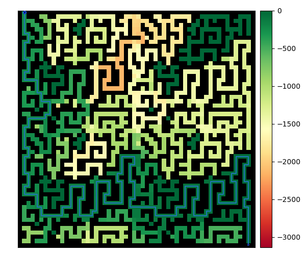
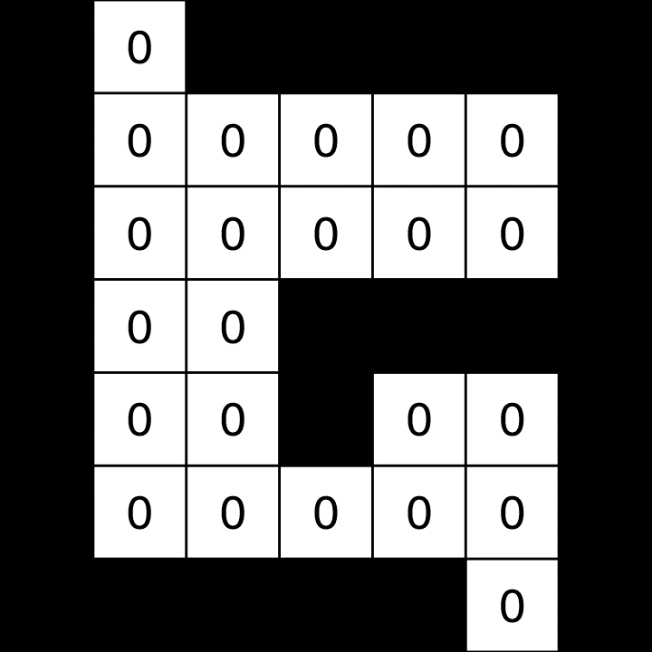
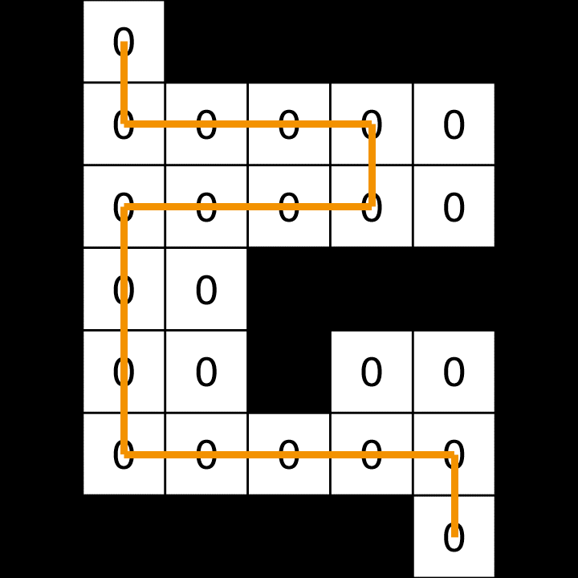
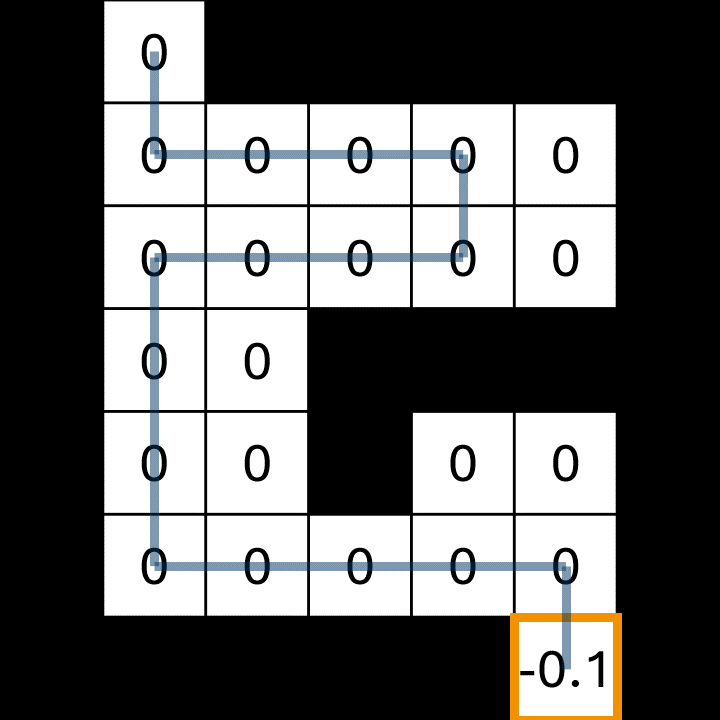
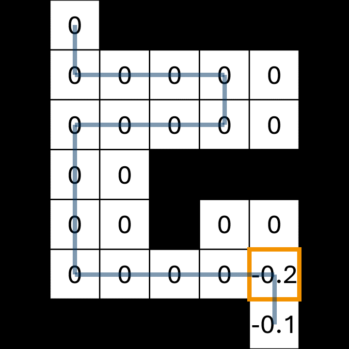
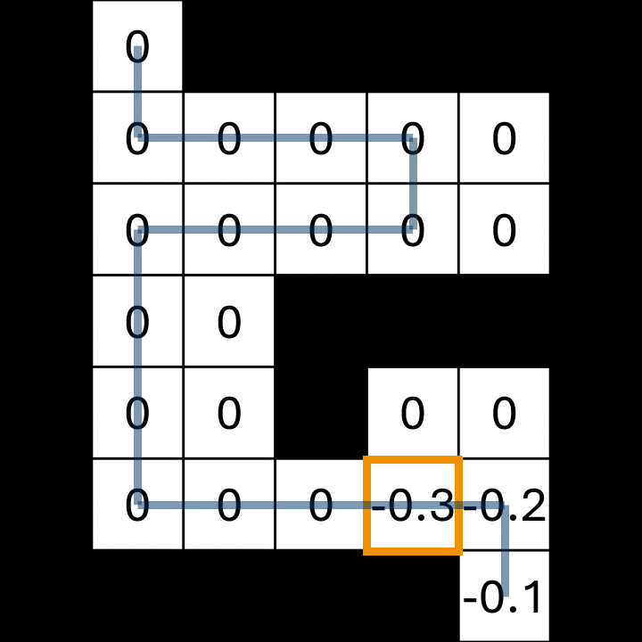
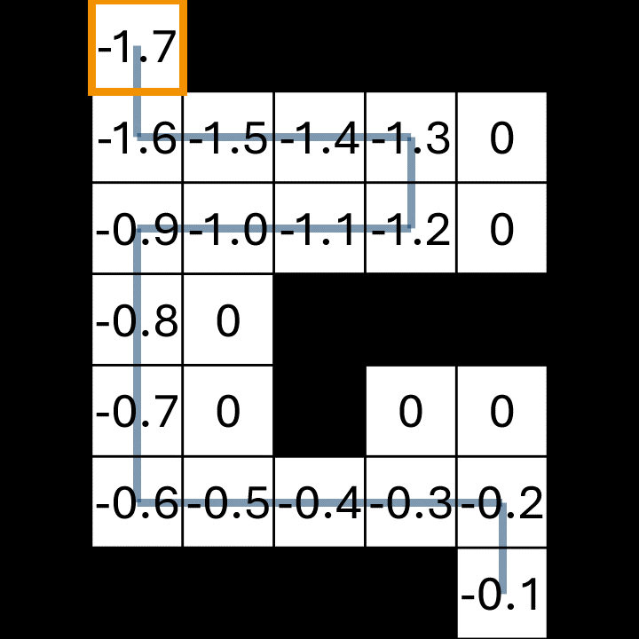
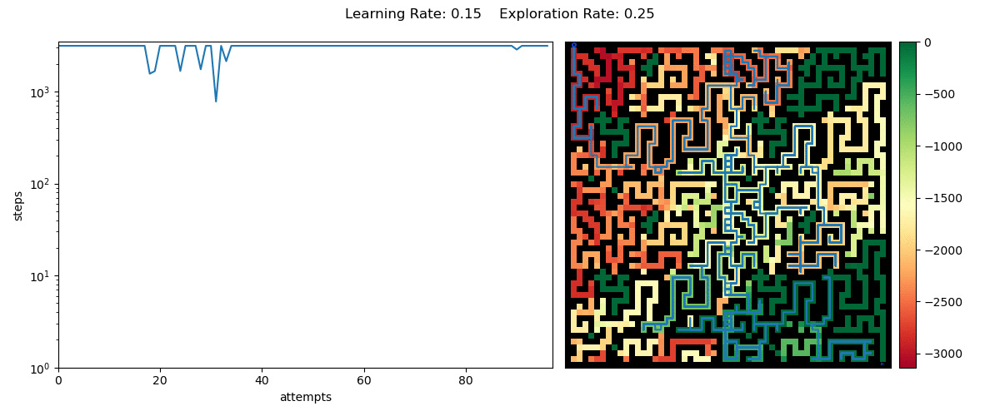
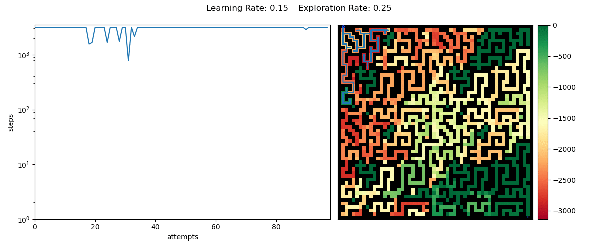
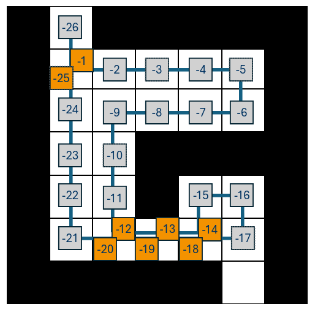

# Solving a Maze - Reinforcement Learning

<div class=hcenter>



</div>

---
# Contents

* Reinforcement Learning - Introduction
* Environment: Maze
* Agent: Robot
* Reward System
* Results and Improvements

--- 

# Reinfocement Learning

<div class=columns3  style="grid-template-columns: 30% 35% 30%;" >
<div>

## (Un)supervised

<br>
<br>

- Need of a training set
  - May be labeld (supervised)
  - Or unlabeld (unsupervised)  

</div>
<div>

## Reinforcement

<br>
<br>

> [...] intelligent agent ought to take actions in a dynamic environment
> in order to maximize the <u>*cumulative reward*</u>.  
> -- <cite>Wikipedia</cite>

</div>

<div >


</div>
</div>

---
# The Environment

<div class=columns style="grid-template-columns: 65% 30%; gap: 3rem">
<div>
<div class=vcenter>

- Provide a system, with which the agent can interact
- Implement game logic

```python
class Maze():

  def get_moves():
  def move(...):
  
  def get_state_and_reward():

  def is_game_over():

  # just for plotting
  def get_steps()
```

</div>
</div>

<div>
<div class=vcenter>

* Stores:
  - Actual maze
  * Player position
* Provides to agent:
  - Possible moves
  * Rewards
* Ends game

</div>
</div>
</div>

---
# The Agent

<div class=columns60_40>
<div>

- Robot which learns to solve the maze

```python
class Agent():

  def __init__(...):
    """set learning/exploration rate"""

  def choose_action(...):

  def store_rewards(...):

  def learn():
```

</div>
<div>

* Initilization with specific
  - learning rate
  * exploration rate
* Choose from possible moves
* Store reward for given positon
* update reward table from rewards collected during one game (learn)

</div>
</div>

---

# Reward System

<div class=columns>
<div>

## Environment

<div>

<br> <br>
<br>

```python
def get_state_and_reward(self):
  return self.pos, -1
```

- penalize each step with -1

<br>
</div>
</div>
<div>

## Agent

<div>

<br>
<br>

- During the game
```python
def store_reward(self, pos, reward):
  self._pos_history.append(tuple(pos))
  self._rew_history.append(reward)
```

* After the game `learn()`

<br>

</div>
</div>
</div>

---

# Reward System - *Agent*

<div class=columns style="grid-template-columns: 55% 45%;">
<div>
<div class=vcenter>

* Agent stores a reward matrix
  * tecnically **G table** *(cumulative)*
* initiallized to zero

</div>
</div>
<div>
<div class=vcenter>



</div>
</div>
</div>

---

# Reward System - *Agent*

<div class=columns style="grid-template-columns: 55% 45%;">
<div>
<div class=vcenter>

- First game is random

</div>
</div>
<div>
<div class=vcenter>



</div>
</div>
</div>

---

# Reward System - *Agent - learning*

<div class=columns style="grid-template-columns: 55% 45%;">
<div>
<div class=vcenter>

$$
  G_\mathrm{path} = 0
$$

</div>
</div>
<div>
<div class=vcenter>


</div>
</div>
</div>

---
<!-- paginate: hold -->

# Reward System - *Agent - learning*

<div class=columns style="grid-template-columns: 55% 45%;">
<div>
<div class=vcenter>

<ul style="display: inline-block;">
  <li> Loop path <b>backwards</b> </li>
  <li style="color:white; --licolor: white;"></li>
</ul>
<br>

$$
  \textcolor{white}{reward_\mathrm{pos} = -1}
$$
$$
  \textcolor{white}{G_\mathrm{path} = G_\mathrm{path} + reward_\mathrm{pos}}
$$

<br>

$$
  \textcolor{white}{G_\mathrm{path} = -1}
$$

<br>
<ul style="display: inline-block;">
  <li style="color:white; --licolor: white;"></li>
</ul>

$$
  \textcolor{white}{G_\mathrm{pos} = G_\mathrm{pos} + \alpha(G_\mathrm{path}-G_\mathrm{pos}) = -0.1}
$$

<br>

</div>
</div>
<div>
<div class=vcenter>



</div>
</div>
</div>

---

# Reward System - *Agent - learning*

<div class=columns style="grid-template-columns: 55% 45%;">
<div>
<div class=vcenter>

- Loop path **backwards**
- Compute cumulative reward along path
$$
  reward_\mathrm{pos} = -1
$$
$$
  G_\mathrm{path} = G_\mathrm{path} + reward_\mathrm{pos}
$$

<br>

$$
  \textcolor{var(--uibk_orange)}{G_\mathrm{path} = -1}
$$

<br>
<ul style="display: inline-block;">
  <li style="color:white; --licolor: white;"></li>
</ul>

$$
  \textcolor{white}{G_\mathrm{pos} = G_\mathrm{pos} + \alpha(G_\mathrm{path}-G_\mathrm{pos}) = -0.1}
$$

<br>

</div>
</div>
<div>
<div class=vcenter>


</div>
</div>
</div>


---

# Reward System - *Agent - learning*

<div class=columns style="grid-template-columns: 55% 45%;">
<div>
<div class=vcenter>

- Loop path **backwards**
- Compute cumulative reward along path
$$
  reward_\mathrm{pos} = -1
$$
$$
  G_\mathrm{path} = G_\mathrm{path} + reward_\mathrm{pos}
$$

<br>

$$
  \textcolor{var(--uibk_orange)}{G_\mathrm{path} = -1}
$$

<br>

- Update reward matrix entry (eg. $\alpha = 0.1$)

$$
  G_\mathrm{pos} = G_\mathrm{pos} + \alpha(G_\mathrm{path}-G_\mathrm{pos}) = -0.1 
$$

<br>

</div>
</div>
<div>
<div class=vcenter>


</div>
</div>
</div>

---

# Reward System - *Agent - learning*

<div class=columns style="grid-template-columns: 55% 45%;">
<div>
<div class=vcenter>

<ul style="display: inline-block;">
  <li style="color:white; --licolor: white;"></li>
  <li style="color:white; --licolor: white;"></li>
</ul>

$$
  reward_\mathrm{pos} = -1
$$
$$
  G_\mathrm{path} = G_\mathrm{path} + reward_\mathrm{pos}
$$

<br>

$$
  \textcolor{var(--uibk_orange)}{G_\mathrm{path} = -2}
$$

<br>
<ul style="display: inline-block;">
  <li style="color:white; --licolor: white;"></li>
</ul>

$$
  G_\mathrm{pos} = G_\mathrm{pos} + \alpha(G_\mathrm{path}-G_\mathrm{pos}) = -0.2
$$

<br>

</div>
</div>
<div>
<div class=vcenter>



</div>
</div>
</div>

---
# Reward System - *Agent - learning*

<div class=columns style="grid-template-columns: 55% 45%;">
<div>
<div class=vcenter>

<ul style="display: inline-block;">
  <li style="color:white; --licolor: white;"></li>
  <li style="color:white; --licolor: white;"></li>
</ul>

$$
  reward_\mathrm{pos} = -1
$$
$$
  G_\mathrm{path} = G_\mathrm{path} + reward_\mathrm{pos}
$$

<br>

$$
  \textcolor{var(--uibk_orange)}{G_\mathrm{path} = -3}
$$

<br>
<ul style="display: inline-block;">
  <li style="color:white; --licolor: white;"></li>
</ul>

$$
  G_\mathrm{pos} = G_\mathrm{pos} + \alpha(G_\mathrm{path}-G_\mathrm{pos}) = -0.3
$$

<br>


</div>
</div>
<div>
<div class=vcenter>



</div>
</div>
</div>

---
# Reward System - *Agent - learning*

<div class=columns style="grid-template-columns: 55% 45%;">
<div>
<div class=vcenter>

<ul style="display: inline-block;">
  <li style="color:white; --licolor: white;"></li>
  <li style="color:white; --licolor: white;"></li>
</ul>

$$
  reward_\mathrm{pos} = -1
$$
$$
  G_\mathrm{path} = G_\mathrm{path} + reward_\mathrm{pos}
$$

<br>

$$
  \textcolor{var(--uibk_orange)}{G_\mathrm{path} = -17}
$$

<br>
<ul style="display: inline-block;">
  <li style="color:white; --licolor: white;"></li>
</ul>

$$
  G_\mathrm{pos} = G_\mathrm{pos} + \alpha(G_\mathrm{path}-G_\mathrm{pos}) = -1.7
$$

<br>


</div>
</div>
<div>
<div class=vcenter>



</div>
</div>
</div>

---
<!-- paginate: true-->
# Reward System - *Agent - choosing*

<div class=columns style="grid-template-columns: 55% 45%;">
<div>
<div class=vcenter>

* Consider second run
* Agent has learned (some) reward matrix
* Choose action towards maximum reward
* Exploration rate:
  * Choose random action by chance

</div>
</div>
<div>
<div class=vcenter>


</div>
</div>
</div>

---

# Small Maze


* Remove Backtracking

---

# And BIGGER?



<ul style="display: inline-block;">
  <li style="color:white; --licolor: white;"></li>
</ul>

---
<!-- paginate: hold-->

# And BIGGER?



* Learning of "false" high cumulative reward

---
<!-- paginate: true-->

# Improved Cumulative Reward

<div class="columns" style="grid-template-columns: 55% 45%;">
<div>
<div class=vcenter>

$$
  G_\mathrm{pos} = G_\mathrm{nos} + \alpha (G_\mathrm{path} - G_\mathrm{pos})
$$

<br>

$$
  \Rightarrow 
$$

<br>

$$
  G_\mathrm{pos} = G_\mathrm{pos} + \alpha (\textcolor{var(--uibk_orange)}{\min\{G_\mathrm{path}\}} - G_\mathrm{pos}) \
$$

</div>
</div>
<div>



</div>
</div>

---
# Hurray!


<!-- LOGARITHMIC SCALE -->

---

<h2 style="text-align: center; color: var(--uibk_orange)">
  Thanks for your attention
</h2>


---

<h2 style="text-align: center;">
  Appendix
</h2>

---

# Bigger!


---

# Removing Backtracking

- If action returns to previous position
  - Remove action from `action_list` and choose again (except for dead end)

```python
def chose_action(action_list):
  ...
  # attempt to make him not reverse moves immediatly
  # If action returns to previous position
  # - remove action from action list if possible (ie. not only option)
  # - choose again
  if tuple(action_list[index]()) == self._pos_history[-2]:
    if len(action_list) > 1:
      action_list.pop(index)
      return self.choose_action(action_list)
```

* May not backtrack directly
* Can still run in loops